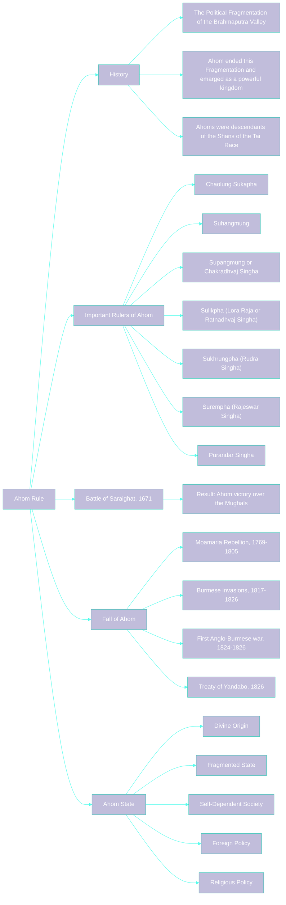

```mermaid
%%{
  init: {
    'align': 'right',
    'theme': 'base',
    'themeVariables': {
      'primaryColor': '#C1BDDB',
      'primaryTextColor': '#fff',
      'primaryBorderColor': '#35C4B6',
      'lineColor': '#58FCEC',
      'secondaryColor': '#006100',
      'tertiaryColor': '#fff'
    }
  }
}%%
graph LR
A[Ahom Rule] --> B[History]
A --> C[Important Rulers of Ahom]
A --> D[Battle of Saraighat, 1671]
A --> E[Fall of Ahom]
A --> F[Ahom State]

%%History
B --> G[The Political Fragmentation of the Brahmaputra Valley]
B --> H[Ahom ended this Fragmentation and emarged as a powerful kingdom]
B --> I[Ahoms were descendants of the Shans of the Tai Race]

%% Important Rulers of Ahom
C --> J[Chaolung Sukapha]
C --> K[Suhangmung]
C --> L[Supangmung or Chakradhvaj Singha]
C --> M["Sulikpha (Lora Raja or Ratnadhvaj Singha)"]
C --> N["Sukhrungpha (Rudra Singha)"]
C --> O["Surempha (Rajeswar Singha)"]
C --> P[Purandar Singha]

%% Battale of Saraighat of Ahom
D --> V[Result: Ahom victory over the Mughals]

%% Fall of Ahom
E -->R[Moamaria Rebellion, 1769-1805]
E -->S[Burmese invasions, 1817-1826]
E -->T[First Anglo-Burmese war, 1824-1826]
E -->U[Treaty of Yandabo, 1826]

%% Ahom state
F -->W[Divine Origin]
F -->X[Fragmented State]
F -->Y[Self-Dependent Society]
F -->Z[Foreign Policy]
F -->ZA[Religious Policy]
```
