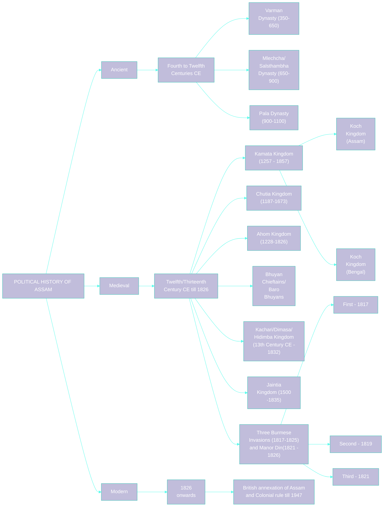

```mermaid
%%{
  init: {
    'align': 'right',
    'theme': 'base',
    'themeVariables': {
      'primaryColor': '#C1BDDB',
      'primaryTextColor': '#fff',
      'primaryBorderColor': '#35C4B6',
      'lineColor': '#58FCEC',
      'secondaryColor': '#006100',
      'tertiaryColor': '#fff'
    }
  }
}%%
graph LR
A[POLITICAL HISTORY OF ASSAM] --> B[Ancient]
A --> C[Medieval]
A --> D[Modern]

%% Ancient Part
B --> E["Fourth to Twelfth\n Centuries CE"]
E --> F["Varman\n Dynasty (350-\n 650)"]
E --> G["Mlechcha/\nSalsthambha\nDynasty (650-\n900)"]
E --> H["Pala Dynasty\n(900-1100)"]

%% Medieval Part
C --> I["Twelfth/Thirteenth\nCentury CE till 1826"]
I --> J["Kamata Kingdom\n(1257 - 1857)"]
J --> K["Koch\nKingdom\n(Assam)"]
J --> L["Koch\nKingdom\n(Bengal)"]
I --> M["Chutia Kingdom\n(1187-1673)"]
I --> N["Ahom Kingdom\n(1228-1826)"]
I --> O["Bhuyan\nChieftains/\nBaro\nBhuyans"]
I --> P["Kachari/Dimasa/\nHidimba Kingdom\n(13th Century CE -\n 1832)"]
I --> Q["Jaintia\nKingdom (1500\n-1835)"]
I --> R["Three Burmese\nInvasions (1817-1825)\nand Manor Din(1821 -\n1826)"]
R --> S["First - 1817"]
R --> T["Second - 1819"]
R --> U["Third - 1821"]

%% Modern Part
D --> V["1826\nonwards"]
V --> W["British annexation of Assam\nand Colonial rule till 1947"]

```
