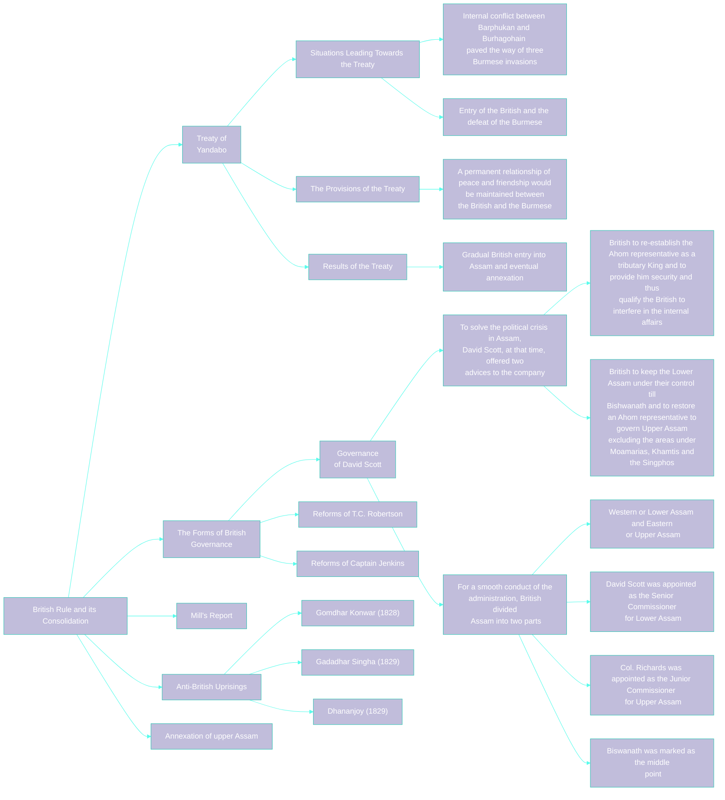

```mermaid
%%{
  init: {
    'align': 'right',
    'theme': 'base',
    'themeVariables': {
      'primaryColor': '#C1BDDB',
      'primaryTextColor': '#fff',
      'primaryBorderColor': '#35C4B6',
      'lineColor': '#58FCEC',
      'secondaryColor': '#006100',
      'tertiaryColor': '#fff'
    }
  }
}%%
graph LR
A[British Rule and its Consolidation] --> B["Treaty of \nYandabo"]
A --> C["The Forms of British\n Governance"]
A --> D[Mill's Report]
A --> E[Anti-British Uprisings]
A --> F[Annexation of upper Assam]


%% Treaty of yandabo
B --> G[Situations Leading Towards the Treaty]
G --> G1["Internal conflict between Barphukan and Burhagohain \n paved the way of three Burmese invasions"]
G --> G2[Entry of the British and the defeat of the Burmese]
B --> H[The Provisions of the Treaty]
H --> H1[A permanent relationship of peace and friendship would\n be maintained between the British and the Burmese]
B --> I[Results of the Treaty]
I --> I1[Gradual British entry into Assam and eventual annexation]

%% The Forms of British Governance
C --> J["Governance\nof David Scott"]
J --> J1["To solve the political crisis in Assam,\nDavid Scott, at that time, offered two\nadvices to the company"]

J1 --> J1A["British to re-establish the Ahom representative as a\n tributary King and to provide him security and thus\n qualify the British to interfere in the internal affairs"]
J1 --> J1B["British to keep the Lower Assam under their control till\nBishwanath and to restore an Ahom representative to\n govern Upper Assam excluding the areas under\n Moamarias, Khamtis and the Singphos"]

J --> J2["For a smooth conduct of the\n administration, British divided\n Assam into two parts"]
J2 --> J2A["Western or Lower Assam and Eastern\n or Upper Assam"]
J2 --> J2B["David Scott was appointed as the Senior Commissioner\n for Lower Assam"]
J2 --> J2C["Col. Richards was appointed as the Junior Commissioner \n for Upper Assam"]
J2 --> J2D["Biswanath was marked as the middle\n point"]

C --> D1[Reforms of T.C. Robertson]
C --> D2[Reforms of Captain Jenkins]

E --> E1["Gomdhar Konwar (1828)"]
E --> E2["Gadadhar Singha (1829)"]
E --> E3["Dhananjoy (1829)"]
```
