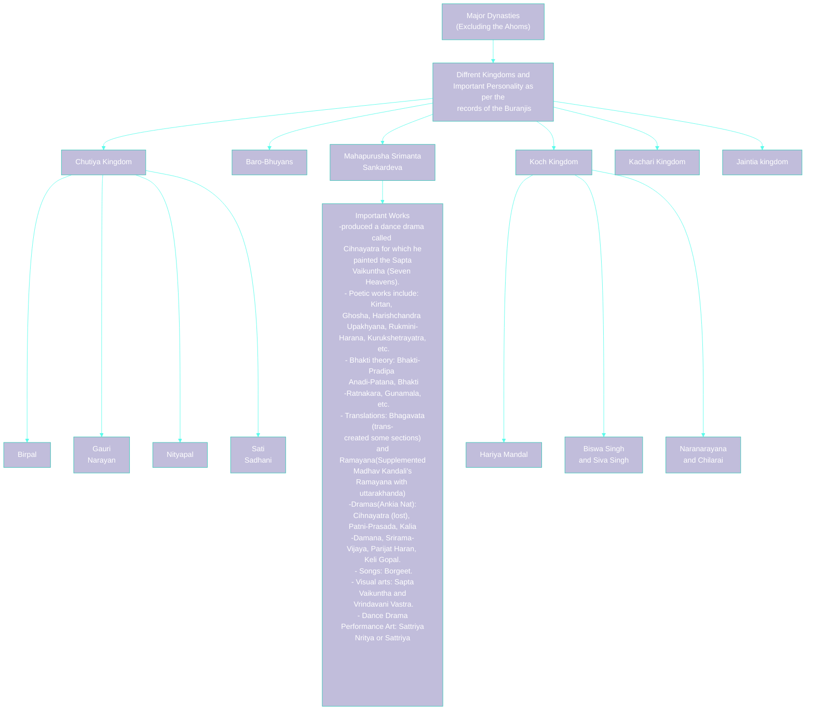

```mermaid
%%{
  init: {
    'align': 'right',
    'theme': 'base',
    'themeVariables': {
      'primaryColor': '#C1BDDB',
      'primaryTextColor': '#fff',
      'primaryBorderColor': '#35C4B6',
      'lineColor': '#58FCEC',
      'secondaryColor': '#006100',
      'tertiaryColor': '#fff'
    }
  }
}%%
graph TD
A["Major Dynasties\n(Excluding the Ahoms)"] --> B["Diffrent Kingdoms and\n Important Personality as per the\n records of the Buranjis"]
B --> C["Chutiya Kingdom"]
B --> D["Baro-Bhuyans"]
B --> E["Mahapurusha Srimanta\nSankardeva"]
B --> F["Koch Kingdom"]
B --> G["Kachari Kingdom"]
B --> H["Jaintia kingdom"]

C --> I["Birpal"]
C --> J["Gauri\n Narayan"]
C --> K["Nityapal"]
C --> L["Sati\nSadhani"]

E --> M["Important Works\n-produced a dance drama called \nCihnayatra for which he\n painted the Sapta \nVaikuntha (Seven Heavens).\n- Poetic works include: Kirtan, \nGhosha, Harishchandra \nUpakhyana, Rukmini-\nHarana, Kurukshetrayatra,\n etc.\n- Bhakti theory: Bhakti-Pradipa \n Anadi-Patana, Bhakti\n-Ratnakara, Gunamala,\n etc.\n - Translations: Bhagavata (trans-\ncreated some sections)\n and Ramayana(Supplemented\n Madhav Kandali's \nRamayana with uttarakhanda)\n -Dramas(Ankia Nat): Cihnayatra (lost), \nPatni-Prasada, Kalia\n-Damana, Srirama-\nVijaya, Parijat Haran, \nKeli Gopal.\n - Songs: Borgeet.\n - Visual arts: Sapta Vaikuntha and\n Vrindavani Vastra.\n - Dance Drama Performance Art: Sattriya\n Nritya or Sattriya \n\n\n\n\n\n"]

%%Koch Kingdom
F --> N["Hariya Mandal"]
F --> O["Biswa Singh\nand Siva Singh"]
F --> P["Naranarayana \n and Chilarai"]
```
