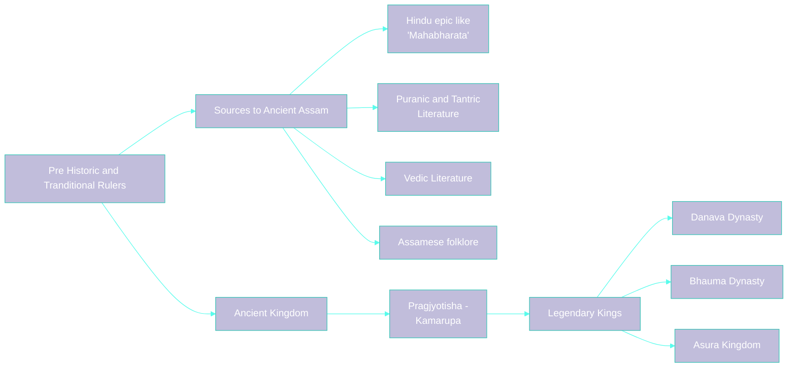

```mermaid
%%{
  init: {
    'align': 'right',
    'theme': 'base',
    'themeVariables': {
      'primaryColor': '#C1BDDB',
      'primaryTextColor': '#fff',
      'primaryBorderColor': '#35C4B6',
      'lineColor': '#58FCEC',
      'secondaryColor': '#006100',
      'tertiaryColor': '#fff'
    }
  }
}%%
graph LR
A["Pre Historic and Tranditional Rulers"] --> B["Sources to Ancient Assam"]
A --> C["Ancient Kingdom"]

%% Sources to Ancient Assam
B --> D["Hindu epic like \n'Mahabharata'"]
B --> E["Puranic and Tantric \nLiterature"]
B --> F["Vedic Literature"]
B --> G["Assamese folklore"]

%% Ancient Kingdom
C --> H["Pragjyotisha -\nKamarupa"]
H --> I["Legendary Kings"]
I --> J["Danava Dynasty"]
I --> K["Bhauma Dynasty"]
I --> L["Asura Kingdom"]
```
