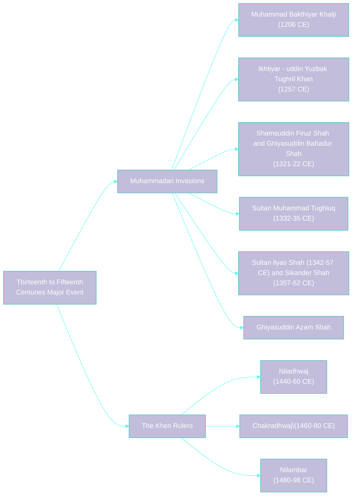

```mermaid
%%{
  init: {
    'align': 'right',
    'theme': 'base',
    'themeVariables': {
      'primaryColor': '#C1BDDB',
      'primaryTextColor': '#fff',
      'primaryBorderColor': '#35C4B6',
      'lineColor': '#58FCEC',
      'secondaryColor': '#006100',
      'tertiaryColor': '#fff'
    }
  }
}%%
graph LR
A["Thirteenth to Fifteenth\n Centuries Major Event"] --> M["Muhammadan Invasions"]
A --> K["The Khen Rulers"]

%% Muhammadan
M --> B["Muhammad Bakthiyar Khalji\n(1206 CE)"]
M --> C["Ikhtiyar - uddin Yuzbak Tughril Khan\n(1257 CE)"]
M --> D["Shamsuddin Firuz Shah and Ghiyasuddin Bahadur Shah\n(1321-22 CE)"]
M --> E["Sultan Muhammad Tughluq\n(1332-35 CE)"]
M --> F["Sultan llyas Shah (1342-57 CE) and Sikander Shah\n(1357-62 CE)"]
M --> G["Ghiyasuddin Azam Shah"]


%% The Khen Rulers
K --> H["Niladhwaj\n(1440-60 CE)"]
K --> I["Chakradhwaj\(1460-80 CE)"]
K --> J["Nilambar\n(1480-98 CE)"]

```
