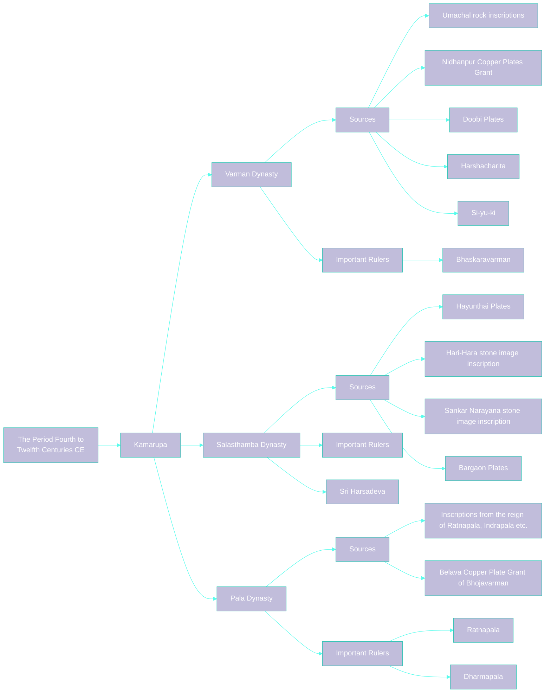

```mermaid
%%{
  init: {
    'align': 'right',
    'theme': 'base',
    'themeVariables': {
      'primaryColor': '#C1BDDB',
      'primaryTextColor': '#fff',
      'primaryBorderColor': '#35C4B6',
      'lineColor': '#58FCEC',
      'secondaryColor': '#006100',
      'tertiaryColor': '#fff'
    }
  }
}%%
graph LR
A["The Period Fourth to \nTwelfth Centuries CE"] --> B["Kamarupa"]
B --> V["Varman Dynasty"]
B --> S["Salasthamba Dynasty"]
B --> P["Pala Dynasty"]

%% Varman Dynasty
V --> C["Sources"]
V --> D["Important Rulers"]

C --> E["Umachal rock inscriptions"]
C --> F["Nidhanpur Copper Plates Grant"]
C --> G["Doobi Plates"]
C --> H["Harshacharita"]
C --> I["Si-yu-ki"]
D --> J["Bhaskaravarman"]

%% Salasthamba Dynasty
S --> K["Sources"]
S --> L["Important Rulers"]

K --> M["Hayunthai Plates"]
K --> N["Hari-Hara stone image inscription"]
K --> O["Sankar Narayana stone image inscription"]
K --> Q["Bargaon Plates"]
S --> R["Sri Harsadeva"]

%% Pala Dynasty
P --> T["Sources"]
P --> U["Important Rulers"]

T --> Z["Inscriptions from the reign of Ratnapala, Indrapala etc."]
T --> W["Belava Copper Plate Grant of Bhojavarman"]

U --> X["Ratnapala"]
U --> Y["Dharmapala"]
```
